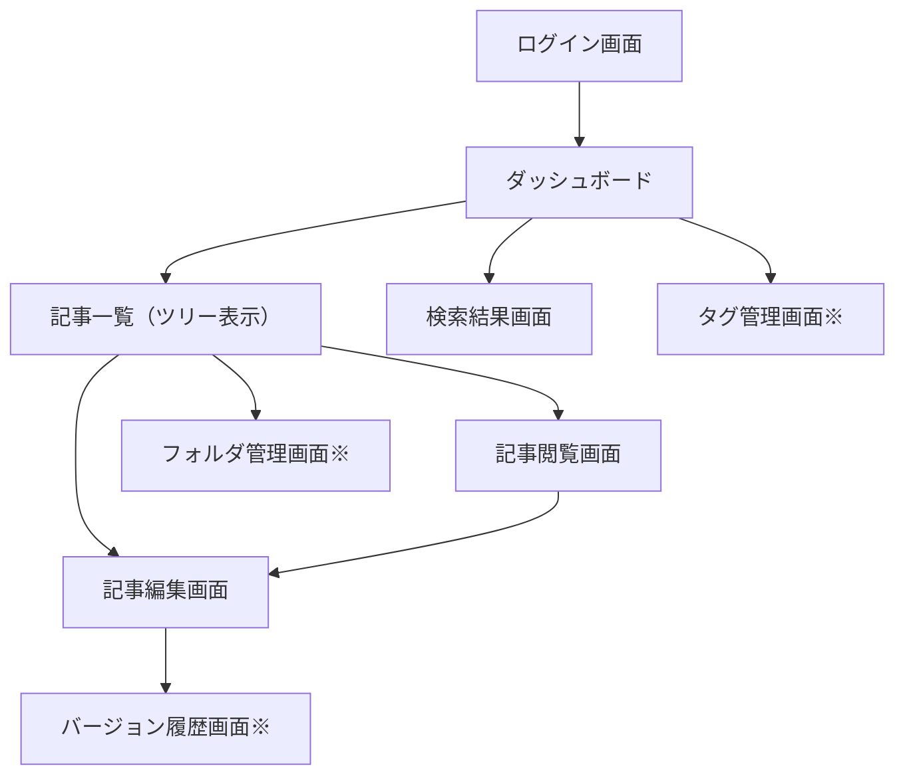

# KnowledgeHub - 画面遷移図（Wireframe）とフロント構成図

## 1. 画面遷移図（Mermaid形式）
### mermaid

### 画面遷移図 × MVP・拡張機能対応表（KnowledgeHub）

| 画面                       | 主な役割                               | MVPチェックリスト対応                              | 拡張機能チェックリスト対応                         |
| -------------------------- | -------------------------------------- | -------------------------------------------------- | -------------------------------------------------- |
| ログイン画面 (A)           | 認証・ユーザー管理                     | 1.1 ユーザー登録・ログイン/ログアウト・権限管理    | なし（拡張は2段階認証等）                          |
| ダッシュボード (B)         | 操作ハブ、最新記事・検索               | 1.4 検索バー、記事一覧表示                         | 2.4 最近更新・人気記事表示、ランキング改善         |
| 記事一覧（ツリー表示） (C) | 記事選択・階層構造                     | 1.2 記事管理（階層構造）、1.4 記事一覧             | 2.4 サイドバー操作性向上                           |
| 検索結果画面 (D)           | 検索結果表示                           | 1.3 タイトル・本文検索、タグ絞り込み、関連度ソート | 2.4 検索結果ランキング改善                         |
| 記事閲覧画面 (E)           | Markdown表示                           | 1.2 記事閲覧                                       | 2.2 ナレッジリンク、2.6 AI補助（サマリー表示）     |
| 記事編集画面 (F)           | Markdown編集、タグ付与、親フォルダ指定 | 1.2 記事編集・下書き・タグ付与                     | 2.1 バージョン管理、2.2 ナレッジリンク、2.6 AI補助 |
| フォルダ管理画面 (G※)      | フォルダ作成・編集・削除               | 1.2 階層構造（簡易管理）                           | 2.4 ツリー操作性改善                               |
| タグ管理画面 (H※)          | タグ一覧・編集                         | MVPでは記事作成時にタグ付与が中心                  | 2.3 タグ管理画面、複数記事横断検索                 |
| バージョン履歴画面 (I※)    | 過去バージョン確認・リストア           | MVPでは履歴保存だけでも可                          | 2.1 差分表示・リストア機能                         |

---

### コメント
- **MVPに必須の画面**は以下：
  - ログイン画面 (A)
  - ダッシュボード (B)
  - 記事一覧（ツリー表示） (C)
  - 検索結果画面 (D)
  - 記事閲覧画面 (E)
  - 記事編集画面 (F)
- **拡張機能画面**は以下：
  - フォルダ管理画面 (G)
  - タグ管理画面 (H)
  - バージョン履歴画面 (I)
- 画面遷移図とチェックリストを組み合わせることで、**開発優先度やワイヤーフレーム作成優先度** が明確になる
- MVP画面に集中してワイヤーフレームを作成 → 拡張機能は後回しで十分

# 0.6 ワイヤーフレーム作成方法（案）
---

## 1. 目的
- KnowledgeHubの画面遷移やUI/UXを可視化
- フロント実装前に操作フローやレイアウトを確認
- チームメンバーやレビュー用に共有可能な形にする

## 2. 作成手順（推奨フロー）

### Step 1: 画面遷移図の整理
- 現在の設計に基づき、主要画面と遷移を洗い出す
  - 例: ログイン画面 → ダッシュボード → 記事一覧 → 記事閲覧/編集
- Mermaid.jsやMiroでフロー図として描くと管理しやすい

### Step 2: ワイヤーフレーム作成ツール選定
- 無料/フリーミアムで使えるツール
  - **UXMagic**：AIでテキストや手書きスケッチから自動生成
  - **Uizard**：簡単なスケッチからプロトタイプ生成
  - **Visily**：直感的なUIでワイヤーフレーム作成可能
  - **Miro**：ホワイトボード型で画面遷移図とワイヤーフレーム両方対応
- 目的に応じて使い分け
  - 初期ラフ作成 → UXMagic / Uizard / Visily
  - 画面遷移・構成確認 → Miro

### Step 3: ワイヤーフレーム作成
- 各画面のUI要素を配置（最低限の情報、ボタン、入力欄、リストなど）
- MVP機能を中心に作成
- 必要に応じて、階層構造・タグ機能・検索バーなども表現

### Step 4: AI補助の活用（任意）
- テキスト説明をもとに画面生成（UXMagic, Uizardなど）
- 自動生成後に微調整して、意図通りのレイアウトに修正

### Step 5: 確認・共有
- 作成したワイヤーフレームをレビュー
- 必要なら改善案を反映して更新
- GitHubやNotionに貼り付けて管理

## 3. 補足
- ワイヤーフレームは **ざっくりでOK**。最終デザインや色付けは後回し
- フロー・操作性の確認が最優先
- MVPに関係ない機能は省略して、開発効率を優先
