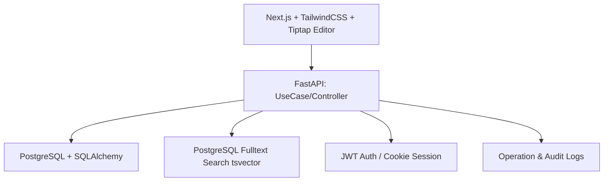

# KnowledgeHub - フロント・バックエンド構成検討

# KnowledgeHub フロント・バックエンド構成詳細

## 1. 各構成要素の役割と目的

### 1.1 Frontend（Next.js + TailwindCSS + Tiptap Editor）

**役割**
- ユーザー操作の受付と画面レンダリング
- 記事作成・編集のためのMarkdownエディタ提供
- SPA体験の実現とレスポンシブUI

**MVP対応**
- 記事一覧表示、記事閲覧・編集画面
- 検索バー、階層構造（ツリー表示）

**拡張対応**
- サイドバーのUX改善、ダッシュボード表示
- ナレッジリンク表示、関連ノート提示

---

### 1.2 API（FastAPI + Clean Architecture）

**役割**
- ビジネスロジックをUseCase層に集約
- データアクセスはRepository層経由で実施
- 認証・権限管理の実装
- 記事CRUD、検索、バージョン管理、ログ収集

**MVP対応**
- 記事作成/編集/削除、検索、認証

**拡張対応**
- 差分表示、AI補助機能、監査ログ管理

**設計ポイント**
- Clean Architectureでフロント依存を最小化
- 将来的な拡張やテスト容易性を確保

---

### 1.3 DB（PostgreSQL + SQLAlchemy）

**役割**
- 永続化、データ整合性、検索最適化
- 記事、タグ、フォルダ、ユーザー、バージョン管理

**MVP対応**
- 基本テーブル(users, articles, tags, article_tags)
- 検索用tsvector + GINインデックス

**拡張対応**
- バージョン差分管理、操作ログ
- 将来的なキャッシュ(Redis)や多言語対応

---

### 1.4 Search（PostgreSQL全文検索）

**役割**
- タイトル・本文全文検索
- タグ絞り込み検索
- 関連度順ソート（タイトル重み付け）

**MVP対応**
- 基本的な検索機能

**拡張対応**
- 高度な検索条件、AIによる関連ノート推薦

---

### 1.5 Auth（JWT / Cookieセッション）

**役割**
- ユーザー認証とセッション管理
- 記事編集権限チェック

**MVP対応**
- メール+パスワードログイン
- 記事編集権限の制御

**拡張対応**
- OAuth連携、二段階認証

---

### 1.6 Logging（操作ログ・監査ログ）

**役割**
- 誰がいつどの操作を行ったか記録

**MVP対応**
- 記事編集時の簡易ログ

**拡張対応**
- APIアクセスログ、管理者用監査画面
- デバッグ・パフォーマンス分析への利用

---

## 2. 設計上の注意点
- Clean Architectureを採用
  - ビジネスロジックをUseCaseに集約し、フロント依存を最小化
  - テスト容易性・拡張性の確保
- DBと全文検索の分離
  - 検索負荷分散や将来の検索エンジン切替が容易
- AuthとLoggingはミドルウェア化
  - APIエンドポイントごとに共通処理として適用可能
- 段階的リリース
  - MVPでは記事CRUD + 検索 + 認証を優先
  - 拡張機能は後回しでポートフォリオ価値向上

---

## 3. 推奨フロー例（MVP利用シナリオ）
1. ユーザーがフロントでログイン → Authが認証
2. ダッシュボードで記事一覧表示 → APIがDBから記事取得
3. 記事検索 → APIがSearchに問い合わせ、関連度順で返却
4. 記事閲覧/編集 → APIがUseCaseで処理、DBに永続化
5. 編集操作 → Loggingで操作ログ記録

---

## 4. まとめ
- フロント・バックエンド・DB・検索・認証・ログの全構成が整理済み
- MVPは最小限で動作するフローを重視
- 拡張機能はUX・ポートフォリオ評価向上のため段階的に追加可能
